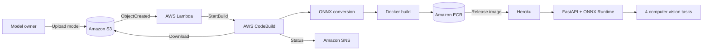

# MLOps-YoloV5

[](https://www.python.org/)
[](https://fastapi.tiangolo.com/)
[](https://onnxruntime.ai/)
[](https://aws.amazon.com/)
[](https://www.docker.com/)
[](LICENSE)

An end-to-end computer vision deployment portfolio demonstrating how a trained
model moves from an S3 upload to an automated, containerized web inference
application.

The repository is deliberately runnable without large model files. In
**placeholder mode**, every endpoint returns a realistic sample response. Add a
compatible `model.onnx` file to a task folder and the same API automatically
uses ONNX Runtime.


## Business Value

Manual model releases are slow, inconsistent, and difficult to audit. This
project turns a model artifact into a repeatable deployment:

1. A data scientist uploads `.pt`, `.pth`, or `.onnx` to Amazon S3.
2. S3 invokes Lambda through an object-created event.
3. Lambda starts AWS CodeBuild with the exact bucket, key, and version.
4. CodeBuild downloads and converts the artifact to ONNX when required.
5. A versioned Docker image is built and pushed to Amazon ECR.
6. Amazon SNS reports build and deployment status.
7. The same image can be released to Heroku's Container Runtime.
8. Users access classification, counting, segmentation, and detection through
   a browser or REST API.

## Architecture



See the [animated workflow](architecture/animated-workflow.gif) and the
[architecture explanation](architecture/architecture-explanation.md).

## Supported Tasks

| Task | Endpoint | Example result |
| --- | --- | --- |
| Classification | `POST /api/v1/classification/predict` | Ranked labels and confidence |
| Object counting | `POST /api/v1/counting/predict` | Total and per-class counts |
| Segmentation | `POST /api/v1/segmentation/predict` | Segment confidence and coverage |
| Object detection | `POST /api/v1/object-detection/predict` | Labels, confidence, and boxes |

Interactive OpenAPI documentation is available at `/docs`; readiness is
reported by `GET /health`.

## Quick Start

```bash
python -m venv .venv
# Windows: .venv\Scripts\activate
# macOS/Linux: source .venv/bin/activate
python -m pip install -r requirements-dev.txt
uvicorn app.main:app --reload
```

Open `http://localhost:8000`, or call the API:

```bash
curl -X POST "http://localhost:8000/api/v1/object-detection/predict" \
  -H "accept: application/json" \
  -F "file=@sample.jpg"
```

Run the automated checks with:

```bash
pytest
ruff check app aws scripts tests
```

## Docker

```bash
docker build -f docker/Dockerfile -t mlops-yolov5:local .
docker run --rm -p 8000:8000 -e PORT=8000 mlops-yolov5:local
```

Or:

```bash
docker compose -f docker/docker-compose.yml up --build
```

The image runs as a non-root user and reads models from `/app/models`.

## Add a Real Model

Place an ONNX artifact at one of these paths:

```text
models/classification/model.onnx
models/counting/model.onnx
models/segmentation/model.onnx
models/object_detection/model.onnx
```

The included generic adapter assumes an NCHW float input and returns an output
preview. Production label, box, or mask decoding belongs in
`app/services/postprocessing.py`. See the
[model conversion guide](docs/model-conversion-guide.md).

## AWS Deployment

1. Create the S3 bucket, ECR repository, SNS topic, Lambda function, and
   CodeBuild project described in the [AWS setup guide](docs/aws-setup-guide.md).
2. Configure CodeBuild to use `aws/codebuild/buildspec.yml` and privileged
   Docker mode.
3. Set the environment variables shown in `.env.example`.
4. Upload a model:

```bash
python scripts/upload_model_to_s3.py best.pt \
  --bucket YOUR_MODEL_BUCKET \
  --region us-east-1
```

No AWS access keys belong in this repository. Use an AWS profile locally and
IAM roles in Lambda and CodeBuild.

## Heroku Deployment

Create a Cedar-generation app using the container stack, set
`HEROKU_APP_NAME` and `HEROKU_API_KEY` securely, then run:

```bash
bash scripts/deploy_to_heroku.sh
```

For automated release from CodeBuild, set `ENABLE_HEROKU_DEPLOY=true` and store
the API key as a secret environment variable. Full instructions are in the
[Heroku deployment guide](docs/heroku-deployment-guide.md).

## Repository Map

| Path | Purpose |
| --- | --- |
| `app/` | FastAPI UI, routes, preprocessing, inference, and postprocessing |
| `aws/` | Lambda trigger, CodeBuild buildspec, SNS, and IAM guidance |
| `docker/` | Reproducible local and cloud container configuration |
| `models/` | Model contracts and ignored artifact locations |
| `scripts/` | Upload, conversion, local inference, and deployment utilities |
| `architecture/` | Static and animated system diagrams |
| `docs/` | Recruiter-friendly overview and technical runbooks |
| `tests/` | API and Lambda behavior checks |

## Demo Media

The `sample_inputs/`, `sample_outputs/`, and `videos/` directories intentionally
contain lightweight placeholders. Replace them with compressed, non-sensitive
portfolio media before publishing a live demo. Suggested filenames are listed
in [videos/README.md](videos/README.md).

## Skills Demonstrated

- Event-driven architecture with S3, Lambda, and CodeBuild
- Model portability with PyTorch-to-ONNX conversion
- Reproducible container builds and ECR image versioning
- FastAPI design, multipart uploads, validation, and OpenAPI
- Multi-task computer vision service organization
- IAM least-privilege planning and secret hygiene
- Deployment notifications with SNS
- Heroku container delivery and cloud-ready `$PORT` handling
- Testing, documentation, troubleshooting, and maintainable project structure

## Future Improvements

- Add model-specific YOLOv5/YOLOv5-seg decoding and visual overlays.
- Provision AWS resources with Terraform or AWS CDK.
- Add ECR vulnerability gates, signed images, and SBOM generation.
- Add integration tests with LocalStack and ephemeral containers.
- Record deployment metadata in DynamoDB for rollback and audit history.
- Add CloudWatch dashboards, latency metrics, and drift monitoring.
- Move Heroku credentials to AWS Secrets Manager during builds.

## Documentation

- [Project overview](docs/project-overview.md)
- [AWS setup guide](docs/aws-setup-guide.md)
- [Heroku deployment guide](docs/heroku-deployment-guide.md)
- [Model conversion guide](docs/model-conversion-guide.md)
- [API usage guide](docs/api-usage-guide.md)
- [Troubleshooting](docs/troubleshooting.md)

## Security and Cost

This is a portfolio reference implementation, not a pre-approved production
platform. Restrict IAM resources to your account, encrypt and version the S3
bucket, scan ECR images, apply retention policies, and configure spending
alerts. Delete unused Heroku dynos and AWS resources to stop charges.

## License

Released under the [MIT License](LICENSE).
