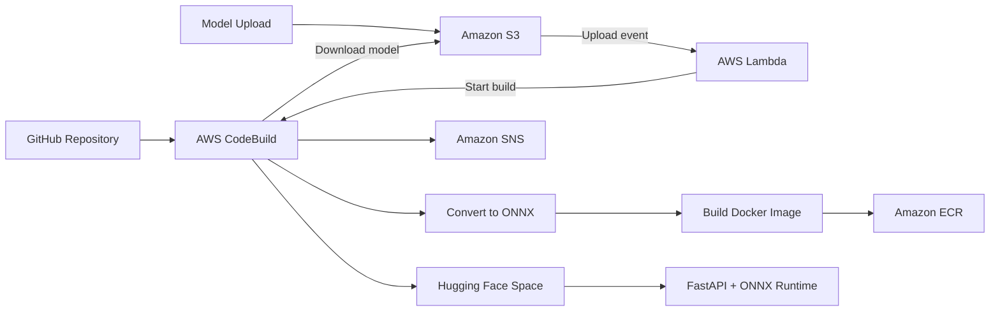

# MLOps-YoloV5

An end-to-end MLOps project that automatically converts and deploys YOLOv5
models for web-based computer vision inference.

[](https://iamkarthik-mlops-yolov5.hf.space/)
[](https://iamkarthik-mlops-yolov5.hf.space/docs)
[](LICENSE)

## About This Project

I built this repository to understand what happens after a machine learning
model is trained.

Instead of manually copying a model to a server, this project treats a model
upload as a deployment event. Uploading a YOLOv5 model to Amazon S3 starts an
automated AWS pipeline that converts the model to ONNX, packages the inference
application in Docker, pushes the image to Amazon ECR, and publishes the web
application to Hugging Face Spaces.

The deployed application supports:

- Object detection
- Object counting
- Scene classification using detected object labels
- Instance segmentation

Official pretrained YOLOv5s and YOLOv5s-seg models are used, so the project can
be demonstrated without training a custom model or committing large model
files to GitHub.

## Architecture




### How the pipeline works

1. A `.pt`, `.pth`, or `.onnx` model is uploaded to Amazon S3.
2. The S3 upload event invokes AWS Lambda.
3. Lambda starts the CodeBuild project and passes the model location.
4. CodeBuild downloads the exact model artifact from S3.
5. PyTorch weights are exported to ONNX when required.
6. The build validates both detection and segmentation inference.
7. A Docker image is created and pushed to Amazon ECR.
8. Amazon SNS sends the deployment result.
9. The FastAPI application and ONNX models are published to a Hugging Face
   Docker Space.

More detail is available in the
[architecture explanation](architecture/architecture-explanation.md).

## What I Built

- An event-driven deployment trigger using S3 and Lambda
- A CodeBuild pipeline for model conversion, validation, and deployment
- PyTorch-to-ONNX conversion for YOLOv5
- A Docker image for portable CPU inference
- FastAPI endpoints with image upload validation
- ONNX Runtime inference with lazy model loading
- YOLOv5 preprocessing, confidence filtering, and class-aware NMS
- COCO class-label validation using ONNX model metadata
- YOLOv5 segmentation mask decoding and transparent overlays
- A browser interface that compares the uploaded image with its prediction
- Separate APIs for detection, counting, classification, and segmentation
- ECR image publishing, SNS notifications, and Hugging Face deployment
- A faster UI-only deployment path for changes that do not replace the model

## Tools Used

<p align="left">
  
  &nbsp;
  
  &nbsp;
  
  &nbsp;
  
  &nbsp;
  
  &nbsp;
  
  &nbsp;
  
  &nbsp;
  
</p>

| Area | Technology |
| --- | --- |
| Model | YOLOv5s, YOLOv5s-seg, PyTorch |
| Inference | ONNX, ONNX Runtime, NumPy, Pillow |
| API and UI | FastAPI, Jinja2, HTML, CSS, JavaScript |
| AWS pipeline | S3, Lambda, CodeBuild, ECR, SNS, IAM |
| Deployment | Docker, GitHub, Hugging Face Spaces |
| Testing | Pytest, FastAPI TestClient, Ruff |

## Inference API

| Task | Endpoint |
| --- | --- |
| Object detection | `POST /api/v1/object-detection/predict` |
| Object counting | `POST /api/v1/counting/predict` |
| Classification | `POST /api/v1/classification/predict` |
| Segmentation | `POST /api/v1/segmentation/predict` |

The web interface includes a sample image for every task, making the live demo
usable without downloading test data.

## Demo

Try the application on
[Hugging Face Spaces](https://iamkarthik-mlops-yolov5.hf.space/).

### Prediction Video

I am preparing a short demo video showing:

- Selecting each computer vision task
- Running predictions with the included sample images
- Uploading a custom image
- Comparing the source image with the model output
- Viewing detection labels, counts, confidence scores, and segmentation masks

The video will be added here after recording:

<!-- Replace this section with the final video or GIF. -->

> Demo video coming soon.

## Repository Structure

```text
app/            FastAPI application, UI, routes, and inference services
aws/            Lambda, CodeBuild, IAM, and SNS configuration
docker/         Container and Docker Compose files
scripts/        Model upload, conversion, inference, and deployment scripts
models/         Model documentation and generated ONNX locations
architecture/   Workflow diagrams and architecture explanation
docs/           AWS, Hugging Face, API, and troubleshooting guides
tests/          API, UI, Lambda, metadata, and postprocessing tests
```

## Run Locally

```bash
python -m venv .venv
python -m pip install -r requirements-dev.txt
uvicorn app.main:app --reload
```

Open `http://localhost:8000`.

The ONNX models are generated by the deployment pipeline and are not stored in
Git. Without them, the application still starts and reports that the models
need to be installed.

## Documentation

- [AWS setup guide](docs/aws-setup-guide.md)
- [Hugging Face deployment guide](docs/huggingface-deployment-guide.md)
- [Model conversion guide](docs/model-conversion-guide.md)
- [API usage guide](docs/api-usage-guide.md)
- [Troubleshooting](docs/troubleshooting.md)

## License

This project is available under the [MIT License](LICENSE).
